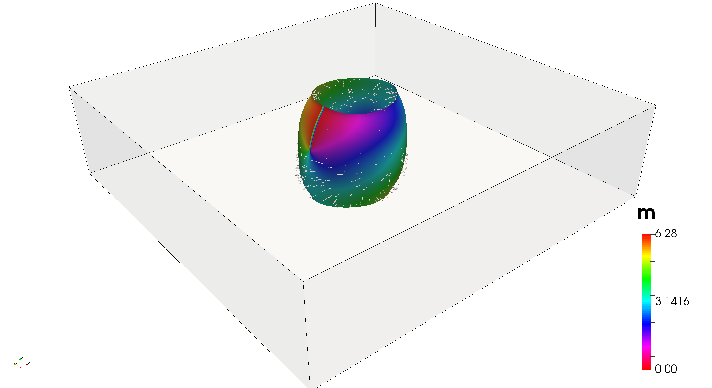

# Supplementary data for: A Reassessment of Magnetic Biskyrmions

This repository contains the micromagnetic simulation scripts for the publication **A Reassessment of Magnetic Biskyrmions** by *J. C. Loudon, A. C. Harrison, D. Cortes-Ortuno, M. T. Birch, L. A. Turnbull, A. Stefancic, F. Ogrin, E. Burgos-Parra, A. Campbell, H. Popescu, M. Beg, O. Hovorka, H. Fangohr, P. A. Midgley, G. Balakrishnan and P. D. Hatton*

Simulations are based on the OOMMF code [2] and its Jupyter interface JOOMMF [3]

# Simulations

Simulation scripts are located in the `sims/oommf` folder, where there are different directories:

- `bubble_lattice_A20pJm-1_mu0Ms648e-3_field-sweep`: simulation of lattice of bubbles in a cuboid sample, starting from an array of hexagonally arranged dots with the out of plane magnetisation direction in the `-z` direction on a background with `m_z=1`

- `bubble_lattice_A-sweep_mu0Ms-sweep_field-sweep`: simulation of a lattice of bubbles by varying the exchange, saturation magnetisation and applied field. These simulations help to find a suitable range of magnetic parameters to stabilise bubbles and compare them to the experimental data 

- `film_random_A20pJm-1_mu0Ms648e-3`: multiple simulations starting from different random initial configurations (random;y oriented spins)

- `film_random_A20pJm-1_mu0Ms648e-3_field-sweep`: (hysteresis-like) field sweep process starting from the random configurations obtained from `film_random_A20pJm-1_mu0Ms648e-3`. These simulations show the formation of spirals and different types of bubbles as the field is increased

- `isolated_typeII_bubble_A20pJm-1_mu0Ms648e-3_field-sweep`: simulation of isolated type-II bubbles in a cuboid sample to analyse their size and applied field range of stability. Simulations are performed for different cuboid sizes. See the `images` folder for different type-II bubble visualisations

Since simulations are based in OOMMF [2], the scripts are given as `.mif` text files. Makefiles are also provided, but tsome paths might require updating. Scripts assume you can run OOMMF using the `oommf` system variable/command.

# Notebooks

Notebooks analysing/processing the data from the simulations are provided in the `notebooks` directory

# Example

An interactive example is given in the main folder to simulate a type-II bubble

# References

[1]

[2] M. J. Donahue and D. G. Porter, *OOMMF Users Guide, Version 1.0*, Tech. Rep. (National Institute of Standards and Technology, Gaithersburg, MD, 1999).

[3] M. Beg, R. A. Pepper, and H. Fangohr, *User interfaces for computational science: A domain specific language for OOMMF embedded in python*. AIP Advances 7, 056025 (2017), https://doi.org/10.1063/1.4977225.
